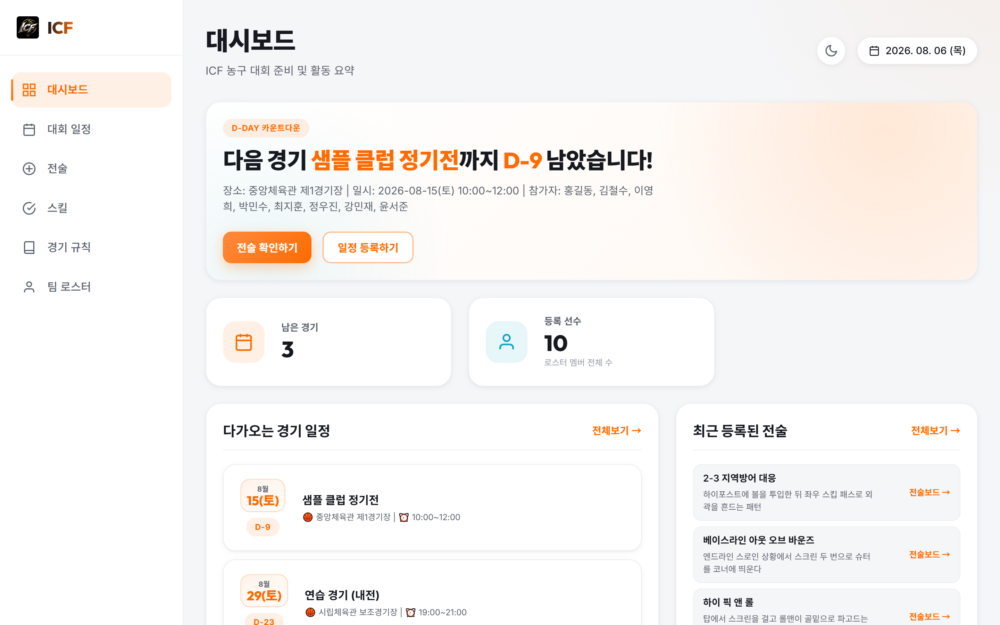
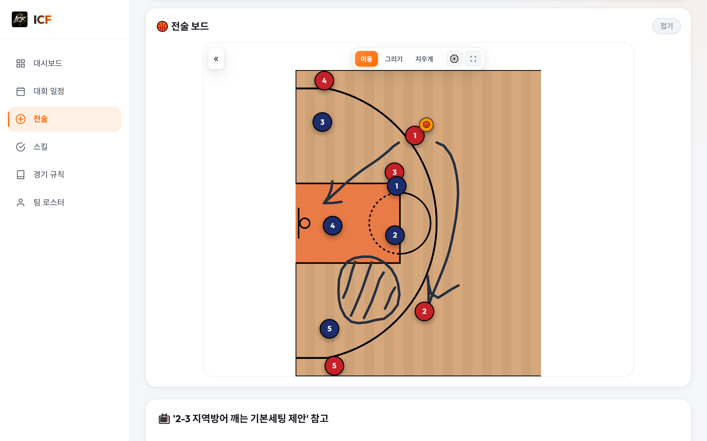
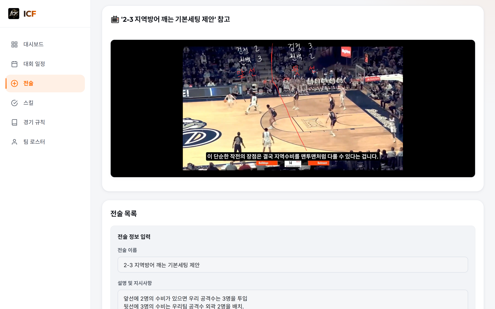
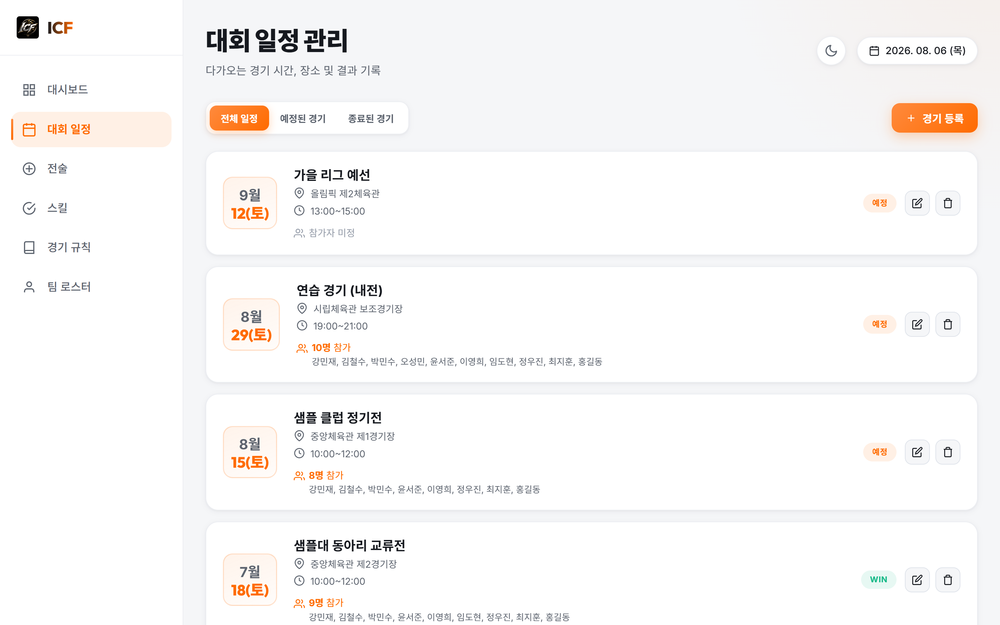
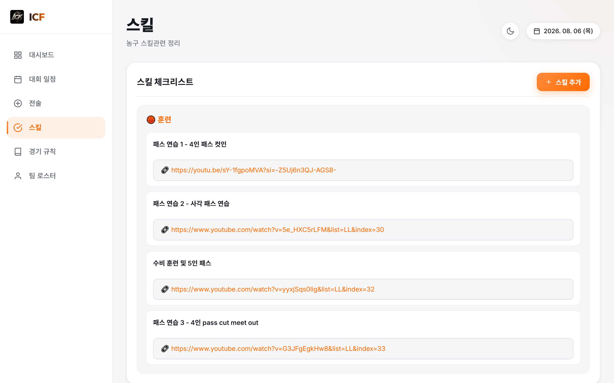
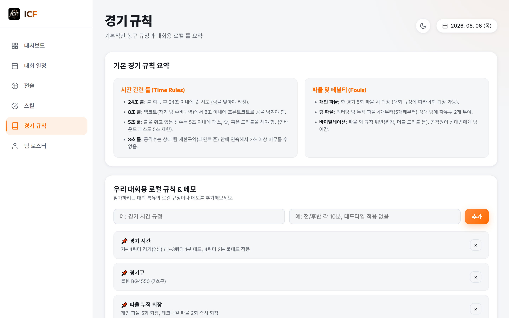
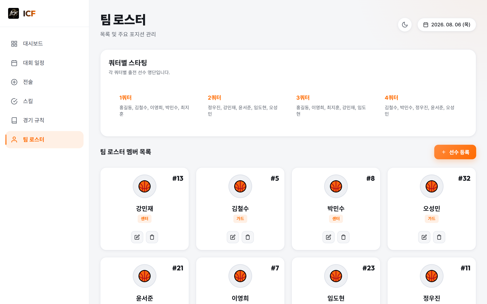
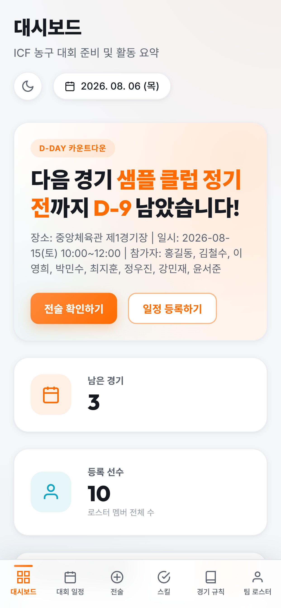
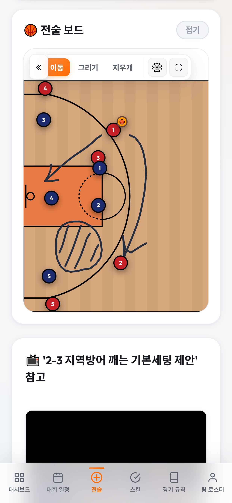

# 🏀 ICF 대회준비

ICF 농구팀의 대회 준비를 위한 팀 관리 웹 애플리케이션입니다.
경기 일정 관리, 인터랙티브 전술 보드, 스킬 체크리스트, 경기 규칙, 팀 로스터를 한곳에서 관리하며, Firebase를 통해 팀원 전체가 실시간으로 데이터를 공유합니다.



## 주요 기능

### 📊 대시보드
- 다음 경기까지의 **D-Day 카운트다운**
- 남은 경기 수 / 등록 선수 수 요약 카드
- 다가오는 경기 일정과 최근 등록된 전술 미리보기

### 📅 대회 일정
- 경기 등록/수정/삭제 (상대 팀, 일시, 장소, 참가자)
- 전체 / 예정된 경기 / 종료된 경기 필터
- 종료된 경기는 점수 기록 가능

### 🎯 전술 보드
- **인터랙티브 농구 코트 보드** (SVG 기반, 하프 코트 / 풀 코트 전환)
- 공격 5명 · 수비 5명 · 볼 토큰을 **드래그로 자유롭게 배치**
- **그리기 모드**: 화살표/일반 선, 5가지 색상으로 동선 표시 (모바일 터치 지원)
- 지우개 모드, 토큰 초기화, 경로 전체 지우기
- 세로 보기 전환, 전체화면 모드, 코트 구역 명칭 안내 서랍
- 전술 저장: 이름, 설명, 참고 링크(유튜브 등), 사진 첨부와 함께 보드 상태 저장/불러오기

### ✅ 스킬
- 카테고리별(슈팅, 드리블, 패스, 수비, 팀 전술 등) 스킬 체크리스트
- 스킬별 상세 설명, 참고 링크, 참고 사진 첨부

### 📖 경기 규칙
- 기본 농구 규칙 요약 (시간 룰, 파울/페널티)
- 참가 대회별 **로컬 규칙 & 메모** 등록

### 👥 팀 로스터
- 선수 등록 (이름, 등번호, 포지션, 프로필 사진)
- **쿼터별 스타팅 라인업** 관리

### 기타
- 🌙 다크/라이트 테마 전환 (localStorage에 저장, 새로고침 시 플래시 방지)
- 📱 모바일/데스크톱 반응형 레이아웃

## 📸 화면 미리보기

> 스킬·전술 화면은 실제 사용 중인 데이터이며, 선수 이름·경기 일정·장소가 나오는
> 화면(대시보드·일정·규칙·로스터)은 데모용 더미 데이터로 촬영했습니다.
> 재촬영은 [screenshots/capture.js](screenshots/capture.js) 참고.

| 전술 보드 | 전술 참고 자료 |
|---|---|
|  |  |

| 대회 일정 | 스킬 |
|---|---|
|  |  |

| 경기 규칙 | 팀 로스터 |
|---|---|
|  |  |

### 모바일

<p>
  
  
</p>

## 기술 스택

| 구분 | 기술 |
|------|------|
| 프론트엔드 | Vanilla JavaScript (ES Modules), HTML, CSS |
| 데이터베이스 | Firebase Firestore (실시간 동기화) |
| 미디어 저장소 | Firebase Storage |
| 오프라인 대응 | localStorage 캐시 |
| 폰트 | Outfit (제목), Inter (본문) — Google Fonts |

프레임워크나 빌드 도구 없이 순수 웹 기술로만 구성되어 있습니다.

## 프로젝트 구조

```
ICF/
├── index.html            # 단일 페이지 앱 진입점 (탭 레이아웃, 모달 마크업)
├── styles.css            # 전체 스타일 (테마 변수, 반응형 포함)
├── app.js                # 앱 초기화, 전역 바인딩, 미디어 입력 연결
├── js/
│   ├── data.js           # 초기 데이터 및 상태 (로스터, 일정, 스킬, 규칙, 라인업)
│   ├── firebase-service.js # Firebase 초기화, Firestore 실시간 동기화, 캐시 관리
│   ├── board.js          # 전술 보드 (토큰 드래그, 그리기, 코트 렌더링)
│   ├── ui.js             # 탭 전환, 목록 렌더링, 모달/폼 이벤트 처리
│   ├── media.js          # 이미지 처리, Storage 업로드, 미리보기/라이트박스
│   └── utils.js          # 공용 유틸리티
├── icf-logo.png          # 팀 로고
├── court-zones.png       # 코트 구역 명칭 안내 이미지
└── screenshots/          # README용 화면 캡처
    └── capture.js        # 캡처 자동화 스크립트 (더미 데이터 주입, 전술 선택)
```

## 데이터 동기화 방식

1. **앱 시작 시** localStorage 캐시를 먼저 로드해 즉시 화면을 표시합니다.
2. Firebase SDK를 **동적 import**로 로드합니다 — CDN 장애 시에도 앱은 로컬 캐시 모드로 정상 동작합니다.
3. Firestore `icf-data` 컬렉션의 키별 문서(`roster`, `schedule`, `skills`, `rules`, `tactics`, `lineups`)를 구독하여 **모든 사용자에게 실시간 반영**됩니다.
4. 저장 시 base64/blob 데이터는 제거하고 Firebase Storage URL만 Firestore에 기록해 문서 1MB 제한을 방지합니다.

## 실행 방법

ES Modules를 사용하므로 로컬 웹 서버로 실행해야 합니다. (파일 직접 열기 ❌)

```bash
# 방법 1: Python
python -m http.server 8000

# 방법 2: Node.js
npx serve .

# 방법 3: VS Code — Live Server 확장 사용
```

이후 브라우저에서 `http://localhost:8000` 접속.

> Firebase 연결에 실패해도 localStorage 캐시만으로 동작하므로, 오프라인 환경에서도 열람이 가능합니다.
